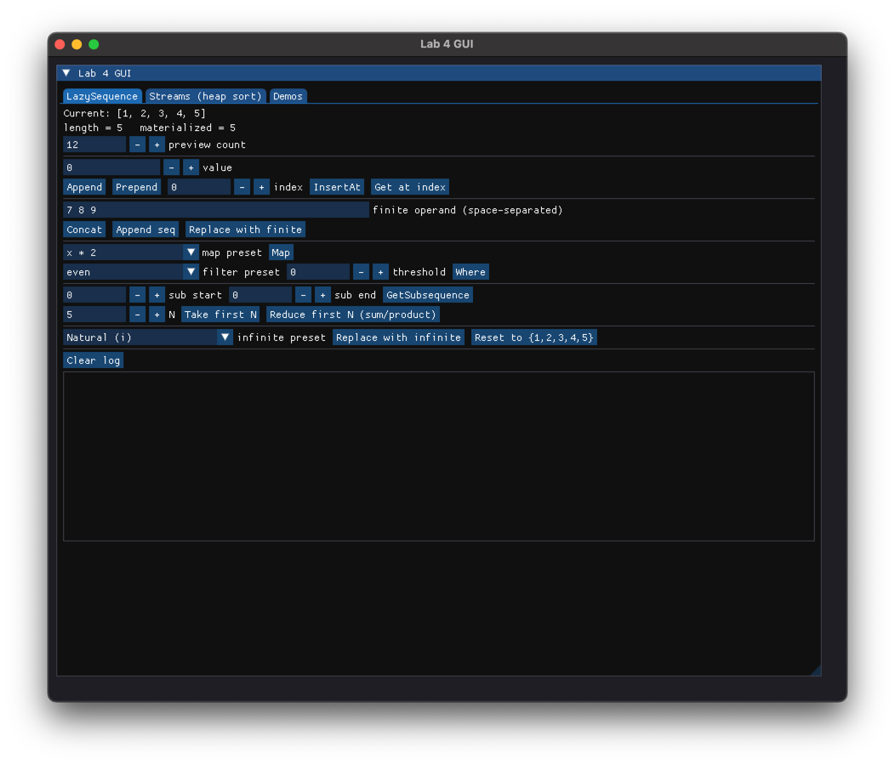

# ЛР 4 – GUI (ImGui + SFML)

## Воспроизводимость

Все зависимости собираются из исходников через CMake FetchContent:

| Зависимость | Версия |
|-------------|--------|
| SFML        | 3.0.2  |
| Dear ImGui  | v1.91.9 |
| imgui-sfml  | v3.0   |

## Сборка

```bash
cd gui
cmake -B build -DCMAKE_BUILD_TYPE=Release
cmake --build build -j
./build/lab4_gui
```

## Что умеет

GUI повторяет функционал CLI (`../main.cpp`) и разбит на три вкладки:

- **LazySequence** — операции над `LazySequence<int>`: Append / Prepend /
  InsertAt / Get по индексу, Concat и Append с конечной последовательностью,
  Map и Where (пресеты), GetSubsequence, Take первых N, Reduce первых N
  (сумма/произведение), замена текущей на конечную (ввод чисел) либо на
  бесконечный пресет (натуральные, квадраты, степени двойки, Фибоначчи).
  Сверху показывается превью первых N элементов, длина (ординал) и число
  материализованных элементов.
- **Streams (heap sort)** — задача 10.2: сортировка потока через бинарную кучу
  по возрастанию/убыванию, сортировка через строковый поток и чтение
  последовательности через поток.
- **Demos** — запускает демонстрации из CLI (конечные/бесконечные
  последовательности, ленивая цепочка Map/Where, Фибоначчи, heap sort).

Результаты и ошибки пишутся в лог внизу каждой вкладки.


## Скриншот:

